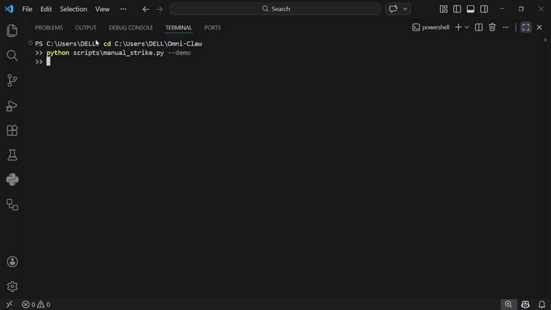

# Demented-Omni-Claw — Offensive AI for Crypto Intelligence
[Security-First] [Explainable-AI] [Zero-Trust] [Contest-Ready]

> Offensive strategy beats Defensive bots. While typical AI tools wait to warn you after the dump, we hunt whale intent, score retail traps before they spring, and broadcast explainable actions—under a zero-trust, signed-skill perimeter.

## Two Operating Modes
**Coach Mode (Behavioral)**
- Retail Trap Score (0–100) with plain-English rationale and DYOR checklist.
- Behavioral nudges: FOMO/Panic detection, overtrading cooldowns, position sizing reminders.
- Narrative tutor: bite-sized education cards for every alert.

**Alpha Radar Mode (Whales / Liquidity / Macro)**
- Whale Shadow: on-chain treasury and smart-money flow tracking.
- Liquidity Sniper: order book + volume spike detection with playbook suggestions.
- Macro Analyzer: TVL and cross-chain rotation signals.
- Narrative Engine: long-context LLM posts for Binance Square, Discord, Telegram.

## Zero-Trust Security Stance
- Signed skill bundles with SHA-256 integrity verification on load.
- Local-only execution path by default; remote skills require explicit opt-in.
- RCE Patch: hardened gateway and loader that block the OpenClaw CVE-2026-25253 vector.
- Hash registry ledger to prevent duplicate or tampered payloads.

## Architecture Snapshot
`
core/                Orchestrator, risk guardian, encrypted config loader
intelligence_nodes/  Whales, liquidity, trap scoring, macro, narrative AI
data_pipeline/       Binance streams, on-chain RPC, memory_vault (SQLite)
distribution_network/ Binance Square, Telegram War Room, Discord broadcast
llm_prompts/         Institutional coach, trap analyst, formatting guards
infrastructure/      Docker, docker-compose, GitHub Actions (infinity loop + QA)
scripts/             setup_war_room.sh, manual_strike.py --demo showcase
`

## Quickstart
1) Clone and install: pip install -r requirements.txt
2) Configure keys: copy .env.example to .env; keys are AES-encrypted by core/config_loader.py.
3) Run the 2-click showcase: python scripts/manual_strike.py --demo
4) (Optional) Daemon mode: python main.py --mode alpha-radar or --mode coach

## Demo Deliverables
- manual_strike.py --demo prints a full Matrix-style alert, including integrity check, whale spike, Trap Score, and a ready-to-post Square/Telegram message with DYOR footer.
- Use the output to record the contest GIF/video—no live keys required.
**Watch the Omni-Claw Zero-Trust AI in action:**

## Contest Positioning
- Offensive intelligence (whales + liquidity) plus behavioral coaching in one pipeline.
- Explainable alerts: every message includes scores, sources, and one-line rationale.
- Security-first: signed bundles, hash registry, CVE-2026-25253 mitigation—built to operate in regulated desks, not hobby servers.

## Roadmap (ship order)
- [x] Demo showcase script
- [ ] Live orderbook + CEX/DEX parity checks
- [ ] Adaptive scoring from user feedback loops
- [ ] Risk Guardian policy packs (conservative / moderate / aggressive)
- [ ] Full remote skill attestation dashboard

## Disclaimer
Pure execution, no financial advice. DYOR. You are responsible for your trades and for complying with local regulations.
